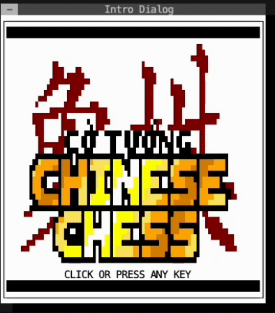
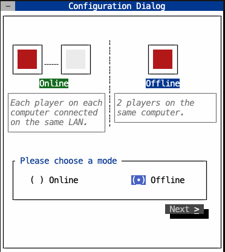

# Chinese Chess for Terminal

There may be a bunch of Chinese Chess games which are playable in so many platforms, either free or commercial. However, as a developer dedicating most of our working hours with the terminal, we feel like a game on our hideous terminal, which we could play with our colleagues within limited networks (e.g. LAN or VPN), is something unique and cool. Wouldn't you agree? 😉

## Installation

## Gameplay
### Intro
The intro has been drawn inspiration from many 8-bit RGB games back in 90s. You may find it old-fashioned and tedious, but it could fill many with nostalgia, believe me.
<div align="center" width="100%">
  
</div>

### Modes
There are 2 main modes you can play in this game: ***Offline*** and ***Online***.
- ***Offline Mode*** allows you to play on a single computer. You can play with, of course, yourself or play with another (but remember not to play rough unless you two want a fight 😏).
- ***Online Mode*** allows you to play with another via a network. Under the hood, the game establishes a web-socket connection, which you (as a dev) can manipulate through either a LAN, a VPN or even 2 containers on the same host.


Below is the screenshot for you to choose the appropreate mode.
<div align="center" width="100%">
  
</div>

> ***Secret Note:*** In this dialogue, if you press the **D** button, the radio button will disappear. The game now enters the ~~super secret~~ ***Debug Mode***, which allows you move the chessmen freely without any turn restrictions. We leave this mode here to easily test the chessman rules and other game machenisms, but it would be interesting if you guys want to do the same. (Help us spot some bugs at least!!! 😜)

### Other Configurations
#### Client
When you choose not to host the game, you have to enter the IP address of the server which is shown on the server's screen.
<br>

_[An illustration needed]_
#### Server
Otherwise, to be a host, show the IP address on your screen to your playmate (not opponent yet).
<br>

_[An illustration needed]_
### Into the Game
After a little bit annoying configurations, it is when you enjoy the game. You may refer the chessman rules elsewhere such as Wikipedia (or should we add a tutorial right before the game starts? ✨✨ Worth a feature!). We only help you show the possible moves of a chosen chessman like this.
<br>

_[An illustration needed]_
<br>

A speical treatment for our Generals is applied. Whenever a General is in check or checkmated, any move that does not help the General escape the situation is not allowed.<br>

_[An illustration needed]_

## Technical Details
_[A wiki page for techical design and architecture will be provided later]_

## Todo
- [x] Write code for IBoard and IChessman
- [x] Write newInstance for IChessman and implementations for every chessman
- [x] Design move chessman mechanism
- [x] Design the User Interface (Ref: https://github.com/gansm/finalcut/blob/main/doc/first-steps.md#first-steps-with-the-final-cut-widget-toolkit)
- [x] Refactor behaviorProviders [Optional] 
- [x] Refactor "include" in source tree.
- [x] Bug: After eliminating the opponent, the piece at the former location does not disappear.
- [x] Integrate websocketpp logging into internal logging system.
- [x] Implement logging module.
- [x] Design ConnectionBase class for both server and client.
- [x] Design server-client model for online gaming (websocketpp preferred).
- [x] Design adapter class between moveManager and connectionBase (callback recv refered)
- [ ] Refactor pieces to optimize memory usage [Optional]
- [x] Multi-platform support (build + run) - Supports x86_64 and ARM64 architectures.
- [ ] Check when the game is over. (MVP: General is captured).
- [ ] Checkmate detection: pubsub mechanism or brute-force. (optinal)
- [ ] Implement in-check before any moving.
- [ ] Public to community network (Blog + Demo).

## System Requirements

### Supported Architectures
- ✅ **x86_64** (Intel/AMD 64-bit)
- ✅ **ARM64** (Apple Silicon, ARM servers, Raspberry Pi 4+)

### Minimum Requirements
- **RAM**: 4GB (8GB recommended)
- **Storage**: 2GB free space
- **OS**: Linux (Ubuntu 20.04+, CentOS 8+, Arch Linux)
- **Docker**: Latest version with multi-platform support (for DevContainer)

### For ARM Systems
See [ARM_COMPATIBILITY.md](ARM_COMPATIBILITY.md) for detailed ARM setup instructions.

## How to install final cut lib to project
``` bash
sudo apt-get update
sudo apt-get install autotools-dev automake autoconf autoconf-archive libtool pkg-config
mkdir libfinal
git clone https://github.com/gansm/finalcut.git
cd finalcut
autoreconf --install --force
./configure --prefix=$(realpath ../libfinal)
make
sudo make install
mv ../libfinal/include/final ../
rm -rf ../finalcut
cd ..
```

## Troubleshoot
In case of the terminal doest show chessman characters, please use the following command before running the game!
``` bash
export LC_ALL=en_US.UTF-8
```

# Github mirroring

## Websocket Document
Reference:
1. https://github.com/zaphoyd/websocketpp
2. https://docs.websocketpp.org/tutorials.html

## How to run this project in VS Code
1. Press **F1** in VS Code to show the command bar, then run *Dev Containers: Add Dev Container Configuration Files...*
2. After the configuration is successfully added, press **F1** again, choose *Dev Containers: Open Folder in Container*
3. Go to *Run -> Run without Debugging* or *Start Debugging* to work with the project.

## How to use the standalone test websocket client/ server to interact with the game locally
The file `test/websocketClient.cpp` should be used to connect with the game. Below are some commands that can be used in the binary `/build/websocketClient`
1. Connect the server: `connect ws://localhost:9000`
2. Show the connection: `show <connection_id>`
3. Send a message: `send 0 example message`
4. Close the connection: `close <connection_id>`

## Contributors
1. Nguyễn Duy Tân
2. Nguyễn Thanh Tâm